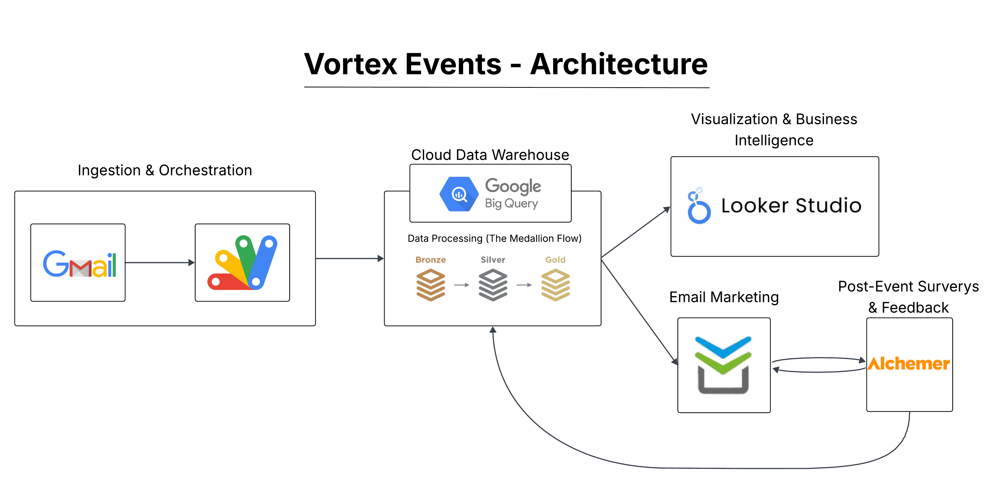
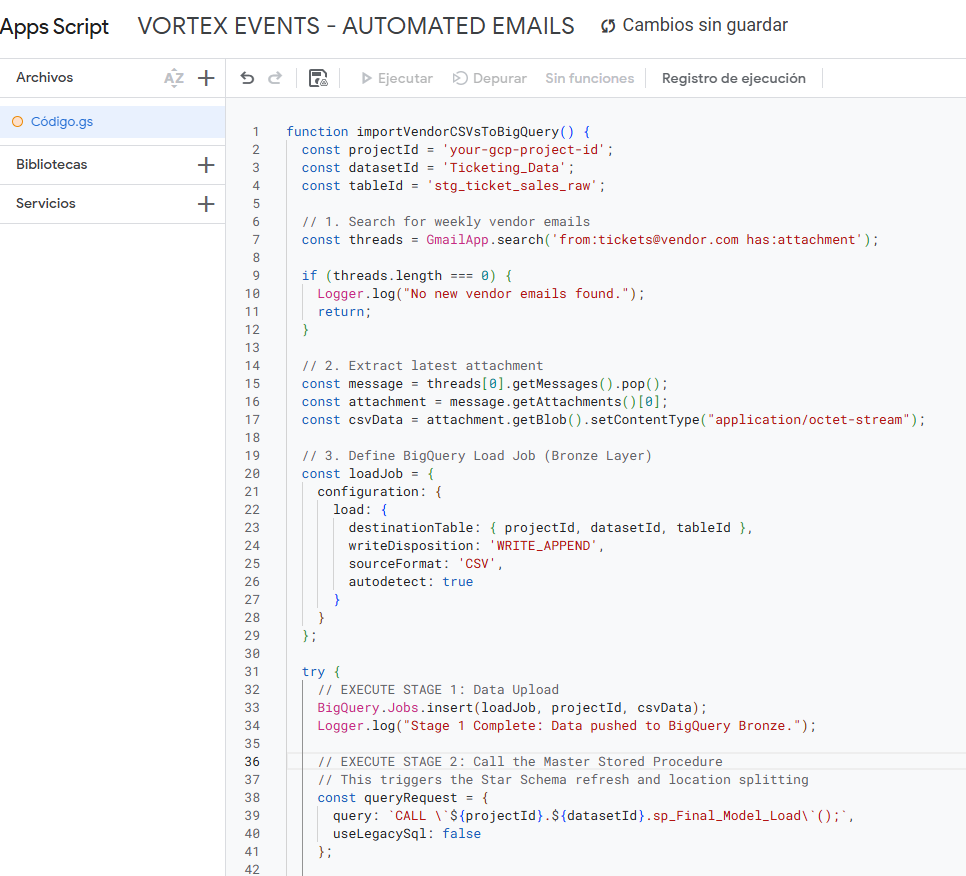
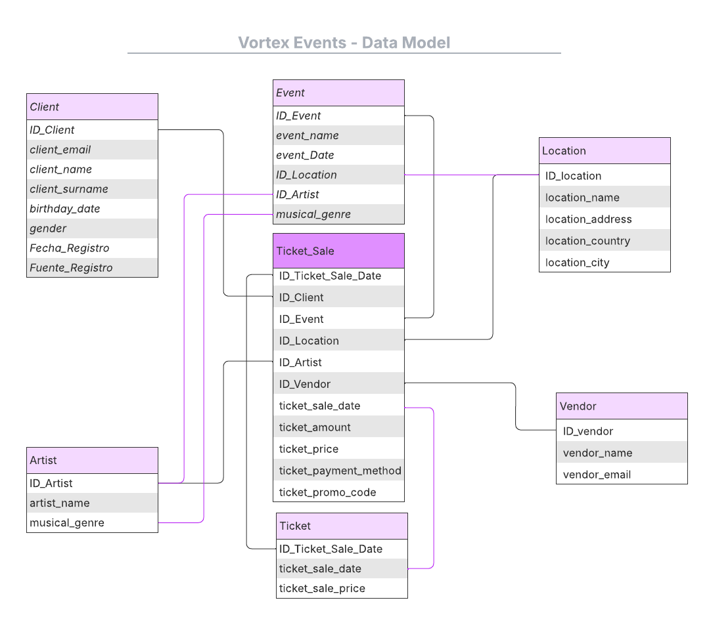
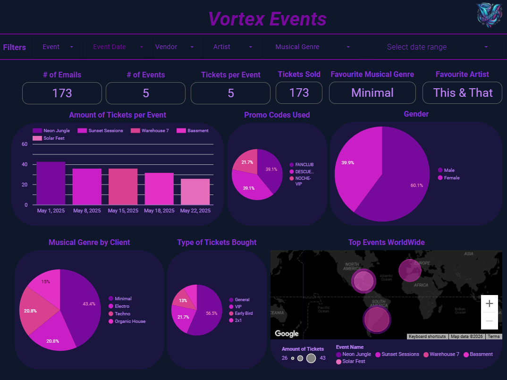
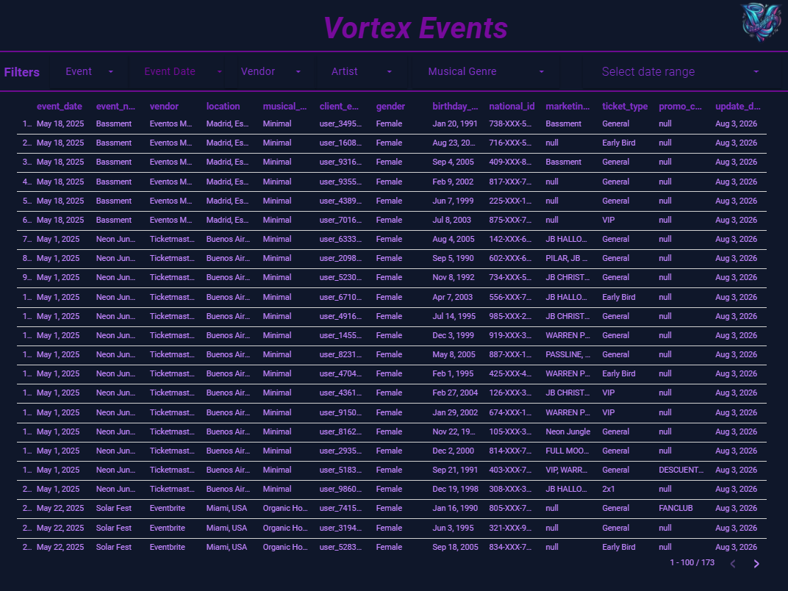

# 📨💃🕺Dance Event Inbound: Scalable Email Automation for 200k+ Fans

   

[SQL](https://img.shields.io/badge/SQL-CC2927?style=for-the-badge&logo=postgresql&logoColor=white)  
[Google Cloud Platform](https://img.shields.io/badge/Google_Cloud-4285F4?style=for-the-badge&logo=google-cloud&logoColor=white)  

---

**Scale: 200,000+ Unique Records | Architecture: Medallion (Bronze to Gold) | Trigger: Monday 12:00 PM**

> **The Problem:** A global events brand was "spreadsheet-locked," manually processing 200k+ records across fragmented vendors, hitting Google Sheets cell limits, and risking Personally Identifiable Information (PII) data leaks.
> **The Solution:** I engineered a **Zero-Manual-Touch** Medallion Architecture in Google Cloud that automates everything from Gmail ingestion to hyper-segmented marketing activation.

## 🏗️ Architecture & Strategy

* **Medallion Flow:** Bronze (Raw) $\rightarrow$ Silver (Standardized) $\rightarrow$ Gold (Dimensional Star Schema).
* **Privacy by Design:** All project data was fully **anonymized** to maintain data regulation compliance, PII (Emails/IDs), ensuring the dataset remains 100% usable for analytics while protecting individual privacy.

---

## 🏗️ Technical Execution

### 1. The Orchestrator (Google Apps Script)

* **Automation:** A Gmail listener triggers every Monday at 12:00 PM, extracting vendor CSVs (Ticketmaster, Eventbrite, Passline).
* **Impact:** Replaced ~4 hours of manual weekly entry with a native BigQuery load job, bypassing the 10-million-cell limit of legacy spreadsheets.

### 2. The Cloud Warehouse (SQL & BigQuery)

* **Data Integrity:** Resolved critical DD/MM/YYYY date-parsing errors found in the 200k+ records using `SAFE.PARSE_DATE`.
* **Star Schema:** Designed a high-performance Dimensional Model with optimized fact and dimension tables (Client, Event, Artist, Location, Vendor) to minimize query costs and maximize dashboard speed.

### 3. Business Intelligence (Looker Studio)

* **KPIs:** Real-time tracking of global sales across Miami, Madrid, and Buenos Aires.
* **UX:** Interactive Dark Mode dashboards with heatmaps to identify top-performing international markets and musical genres.

* **Link to Dashboard:** https://lookerstudio.google.com/reporting/dd45dc32-30ca-417a-83c7-59a3597ffe59

---

## 📈 Business Impact & ROI

* **Scalability & Long-Term Worth:** Engineered to maintain high-performance levels as data grows from 200,000 to millions of records, ensuring the infrastructure remains a viable long-term asset.
* **Marketing-Driven KPIs:** All metrics and Key Performance Indicators were specifically adjusted to provide direct solutions to the marketing team's needs, such as tracking high-attendance genres like Techno and Minimal to guide campaign spend.
* **Real-Time Global Tracking:** Provides a live overview of sales and customer behavior across Miami, Madrid, and Buenos Aires.
* **Accessibility for Non-Cloud Users:** The second page (Table View) features a familiar "Excel-style" data table designed specifically for team members unfamiliar with cloud environments or BigQuery, allowing them to apply their own filters and export raw data easily for offline use.
* **UX/UI:** A professional Dark Mode interface featuring interactive heatmaps to identify top-performing international markets at a glance.
* **Post-Event Loop:** Integrated **Alchemer** surveys back into BigQuery to enrich customer profiles for the next event cycle.

## 🛠️ Technical Stack

* **Languages:** SQL (BigQuery/DML), JavaScript (Google Apps Script).
* **Cloud:** Google Cloud Platform (BigQuery, IAM).
* **Ecosystem:** Gmail, Looker Studio, Perfit, Alchemer.

## 💡 Key Learning: "Build for Scale"

The biggest challenge was moving from a "Flat File" mindset to a **Dimensional Modeling** mindset. By separating data into Dimensions (Who, Where) and Facts (Sales), I ensured the platform could grow from 200k to 2 million records without a decrease in analytical performance.
